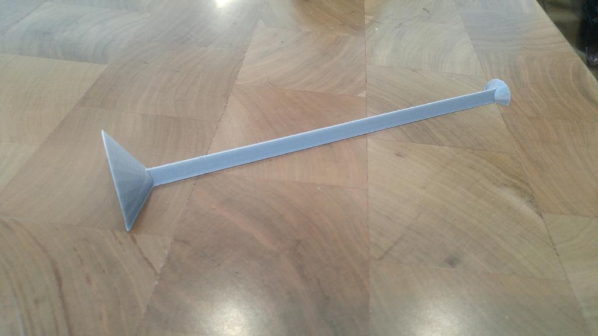
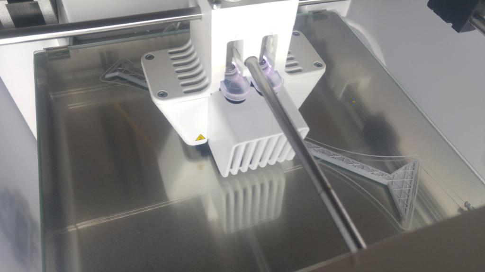
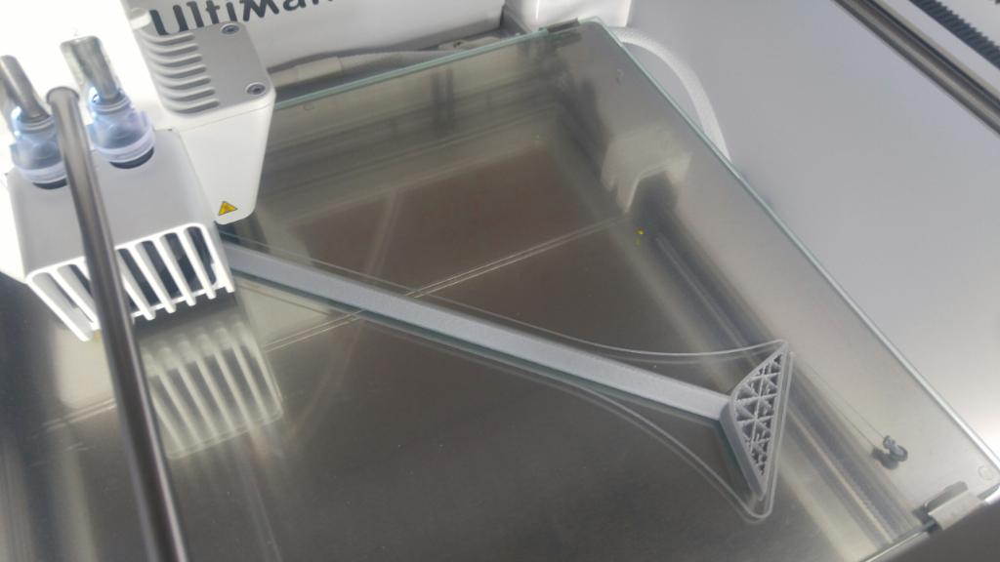

# 3D-printed elevator button reacher
_3D-printed elevator button reacher for accessibility created with OpenSCAD_

## What is it?

This tool assists a person reach to push buttons, specifically in an elevator. It was written in **OpenSCAD**, **scaled larger** using Ultimaker Cura software, then printed on an **Ultimaker 3**.

<!-- After printing, we added a grip material to the end so it works better on buttons. -->

More information can be found on its [Thingiverse page](https://www.thingiverse.com/thing:3918660).

## What's in this repo?

This repository contains the OpenSCAD `.scad` file, `.stl` file, and `.gcode` file. It also contains three images, embedded at the bottom of this README.

## About the creators

Created by [Grady Thompson](https://github.com/gradyat) and [Matt Ziegler](https://github.com/mziegler)

For [CSE 599: Special Topics on Accessible Technology](https://make4all.org/portfolio/future-access-technology-2019/), Autumn 2019, at the University of Washington

## Pictures

After printing, without grip attached at end.

While printing.

While printing, a little later.

